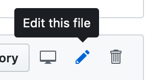

# garbage_repo

## Workflow:
1. Клонування репозиторію на локальний ПК:
    - Створено репозиторій з назвою ["garbage_repo"](https://github.com/altersights/garbage_repo) засобами github.com
    - Для копіювання репозиторію було використано та виконано наступну команду в linux-терміналі:
      - `git clone https://github.com/altersights/garbage_repo.git learn_git`
    - Де: `learn_git` - назва директорії в яку було скопійовано файли з репозиторію
    
2. Commit:
    - Для того щоб додати зміни до віддаленого репозиторію необхідно:
      - Додати необхідні файли до коміту: `git add .`
      - `git add .` запам'ятовує зміни в поточній директорії
    - Наступним кроком виконується `git commit -m "коментар"`
    - Щоб завантажити зміни до віддаленого репозиторію виконується команда:
      - `git push`
      
3. HASH:
    - `git log` - Отримання логів здійснених комітів
    - Початковий коміт має хеш: 05d76428eb6b54f244bdf3c779b7e71ee9245778
      - (додано файл README.md засобами github.com)
    - Другий коміт має хеш: f611d39400580d9ba31ef17ab4422c5c3716eba9
    - Всі внесені зміни перевірено: local && remote => true

4. Branching:
    - Для створення гілки:
      - `git branch pray_for_changes`
      - де `pray_for_changes` - назва гілки
    - Для створення гілки у віддаленому репозиторії:
      - `git push origin pray_for_changes`
    - Для того щоб змінити (переключитись на) гілку:
      - `git checkout pray_for_changes`

5. CHANGES:
    - Перевірив - зміни не відображаються.
    - Чому? Тому, що була створена нова гілка і всі зміни проводилися в ній.
    - Такий підхід корисний коли необхідно внести кардинальні зміни до основного проекту.
    - наприклад, це може бути створення та тестування нової нестабільної функції
    - тому, щоб не зламати основний код, створюють нові гілки і всі зміни роблять там.

6. Merging:
    - В процесі об'єднання двох гілок виникла помилка:
      - `Auto-merging README.md`
      - `CONFLICT (content): Merge conflict in README.md`
      - `Automatic merge failed; fix conflicts and then commit the result.`
    - В файлах була помилково вказана цифра 5-го пункту на головній гілці (master)
    - Файл з помилками об'єднання, було відредаговано вручну

7. Done

8. Done

9. REMOTE CHANGES:
    - Відредагував файл у веб-версії GIT
    - Очевидно, що GIT не синхронізує зміни з віддаленого репозиторію на локальний автоматично.
    - Для отримання змін з віддаленого репозиторію необхідно виконати команди:
      - `git pull`
      - `git add .`
      - `git commit`

10. IMAGES marGdOWN:
     - Ваша картинка, сэр:
       -  
