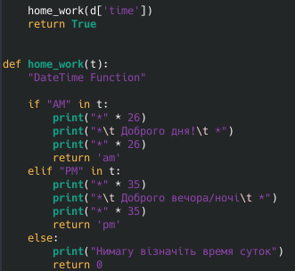
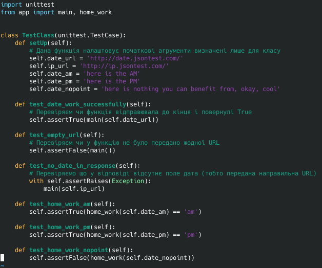

## Lab_2: Автоматизація. Знайомство з CI/CD.

### Pre-requirements:

- віртуальна машина на основі Ubuntu 18.04; 

  - (Ah, nope, i have Arch Linux installed, but trust me - everything's gonna be fine)

- встановлено програми git, make, Python 3.7, [PIP](https://linuxize.com/post/how-to-install-pip-on-ubuntu-18.04/);

  - Done: 

  - 


## Workflow.

1. ( :heavy_check_mark: ) Створіть папку lab_2 з _README.md_ файлом (далі це буде *документація* Вашого проекту). У даному файлі опишіть відповіді на запитання/пояснення кожного пункту роботи.

    

2. ( :heavy_check_mark: ) За допомогою пакетного менеджера *PIP* інсталюйте `pipenv` та створіть ізольоване середовище для Python. Ознайомтесь з командаю `pipenv -h`.

    - 

    

3. ( :heavy_check_mark: ) Встановіть бібліотеку `requests` у Вашому середовищі. Дана бібліотека дозволить створювати HTTP запити до заданих Web сторінок.

    -  

    

4. ( :heavy_check_mark: ) Створіть файл `app.py`. Це буде програма яку потрібно протестити та запустити. Скопіюйте код програми із даного репозиторію до себе. Для кращого розуміння програми ознайомтесь з [Python tutorial](https://www.tutorialspoint.com/python/index.htm)

    -  

    

5. ( :heavy_check_mark: ) Переконайтесь що програма працює правильно.

    -  

    

6. ( :heavy_check_mark: ) Встановіть бібліотеку `pytest`. Тестування - це процес перевірки правильності відпрацювання коду. Для кращого розуміння ознайомтесь з [документацією pytest](https://docs.pytest.org/en/latest/#).

    -  

    

7. ( :heavy_check_mark: ) Приклади тестів знаходяться в окремій папці `tests`. Запустіть тести та переконайтесь що вони виконались успішно:

    -  


8. :exclamation: (Захист) ( :heavy_check_mark: ) У програмі дописати функцію яка буде перевіряти час доби AM/PM та відповідно друкувати: Доброго дня/ночі;

    - 

    -  

    

9. :exclamation: (Захист) ( :heavy_check_mark: ) Написати тест що буде перевіряти правильність виконання Вашої функції;

    -   

    
10. ( :heavy_check_mark: ) Перенаправте результат виконання тестів у файл `results.txt` а також додайте результат виконання програми у кінець цього ж файлу (append). Вкажіть у документації якою командою Ви це зробили;
    - Перенаправлення стандартного потоку виводу (stdout) з допомогою `>`
    - Допис в кінець файлу (append) за допомогою `>>`
      ``` 
      pytest tests/tests.py > results.txt
      echo -e "\n#########################################################################\n" >> results.txt
      python app.py >> results.txt
      ```
11. ( :heavy_check_mark: ) Зробіть коміт із Вашими змінами до репозиторію.

12. ( :heavy_check_mark: ) Заповніть `Makefile` необхідними командами (bash) для повної автоматизації процесу СІ Вашого проекту (_дані директиви це по суті bash команди які Ви виконували у попередніх пунктах але трішки модифіковані_):

- директива install - повинна інсталювати середовище за допомогою pipenv;

- директива test - повинна запускати тести та записувати результат у файл;

- директива run - повинна виконувати програму та записувати результат у файл;

- директива deploy - повинна автоматично робити git commit/push файла `results.txt`;

13. ( :heavy_check_mark: ) Закомітьте зміни в `Makefile` до репозиторію та перейдіть на віртуальну машину Ubuntu;

14. ( :heavy_check_mark: ) Склонуйте git репозиторій на віртуальну машину Ubuntu. Перейдіть у папку лабораторної роботи та запустіть make:

```bash

make

```

- `make` / `pip` / `python` - повинен бути вже інстальовані;

- Результат виконання команди `make` має бути створене ізольоване середовище (venv), виконані тести, запущена програма та закомічений файл у git; 

15. ( :heavy_check_mark: ) Після успішного виконання роботи відредагуйте Ваш персональний _README.md_ у цьому репозиторію. Створіть таблицю яка ставить у відповідність номер лабораторної роботи та URL посилання на папку з виконаною роботою у Вашому першосональному репозиторію. Створіть пул-реквест до основного репозиторію.


