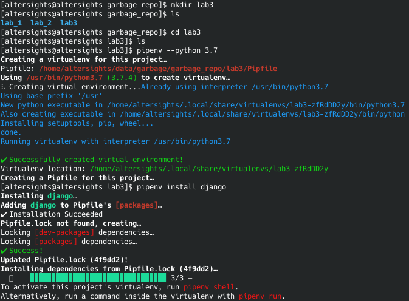
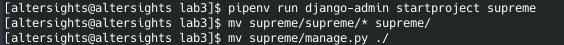
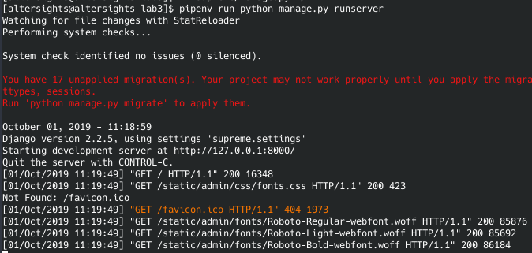
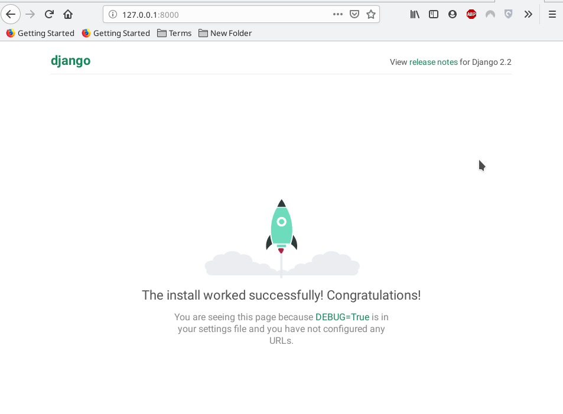
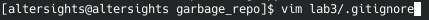
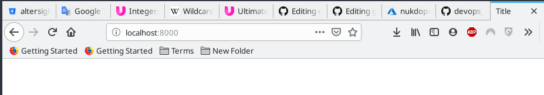
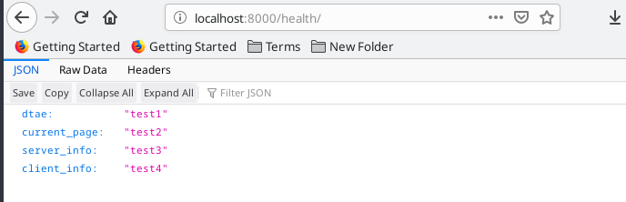

## Lab_3: Вступ до моніторингу.
### Pre-requirements:
- середовище з інстальованим Python / pip / pipenv;
- будь-який WEB-браузер;

### What to do.
1. ( :heavy_check_mark: ) Створіть папку з назвою лабораторної роботи у власному репозиторію. Перейшовши у папку ініціалізуйте середовище `pipenv` та встановіть необхідні пакети:
    -  
    
2. ( :heavy_check_mark: ) За допомогою Django Framework створіть заготовку (template) Вашого проекту  (у мене назва my_site, Ви можете назвати його по іншому). Для зручності винесіть всі створені файли на один рівень вище щоб структура проекту була такою як показано нижче: 
    ```bash
    pipenv run django-admin startproject my_site
    
    mv my_site/my_site/* my_site/
    mv my_site/manage.py ./
    ```
    - 
    
3. ( :heavy_check_mark: ) Переконайтесь що все встановилось правильно і Ви можете запустити Django сервер. Виконайте команду вказану нижче та перейдіть за посиланням яке вивелось у консолі (згідно дефолтних налаштувань потрібно перейти на localhost:8000):
    
    - 
    - Результат в браузері:
      - 
      
4. ( :heavy_check_mark: ) Якщо все запустилось успішно і стартова сторінка Django відображається коректно, зупиніть сервер виконавши переривання `Ctrl+C`. Створіть коміт із базовим темплейтом сайту. За бажанням ознайомтесь із функціоналом [Django Framework](https://www.djangoproject.com/);
    > Після запуску сервера у поточні папці також створиться файл бези даних (`db.sqlite3`) який не потрібно комітити в репозиторій.
    
    - Створив файл `.gitignore`, для того щоб заборонити відслідковування змін в файлах: `db.sqlite3`, `README.md` (тимчасово), та власне в самому файлі `.gitignore`. Файл `.gitignore` дозволяє перечислити список файлів, які не потрібно відслідковувати та додавати в коміт:
      - ` echo -e ".gitignore\nREADME.md\ndb.sqlite3" > lab3/.gitignore `
      - 
    - Після чого по старінке:
      - ```
        git add .
        git commit -m "Lab_3_4: Django Basic Template"
        git push origin master
        ```
      
5. ( :heavy_check_mark: ) Далі створіть темплейт Вашого додатку (app) у якому буде описано всі web сторінки Вашого сайту (я назвав додаток main). Створіть коміт із новоствореними файлами темплейту додатка:
    ```bash
    pipenv run python manage.py startapp main
    ```
6. ( :heavy_check_mark: ) До даного кроку у Вашому репозиторію повинно бути всі базові темплейти Django та файли віртуального середовища. Використовуючи можливості IntelliJ створіть папку `main/templates/`, а також у даній папці файл з розширенням `.html` (`main.html`). Також у папці додатку створіть ще один файл `main/urls.py`. Зробіть коміт із даними файлами;
    > ~~Використовуйте можливості IntelliJ та її плагіній при створенні файлів, оберіть тип файлу `html` і далі вкіжіть його імя, IntelliJ автоматично згенерує темплейт файлу даного типу із початковим кодом.~~
    > Використовуйте можливості of powerful bash shell і створіть ці файли "вручну" (або силою думки):
    
    ``` 
    mkdir main/templates &&
    touch main/templates/main.html main/urls.py
    ```
    
    - Сверхсложний темплейт згенерований (Pycharm):
    ```
    echo -e "
    > <!DOCTYPE html>
    bash: !DOCTYPE: event not found
    > <html lang="en">
    > <head>
    >     <meta charset="UTF-8">
    >     <title>Title</title>
    > </head>
    > <body>
    > 
    > </body>
    > " > main/templates/main.html
    ```
    
7. ( :heavy_check_mark: ) Після створення додатку нам потрібно вказати Django frameworks його назву та де шукати веб сторінки. Це здійснюється у файлі `my_site/settings.py`у змінній `INSTALLED_APPS`, а також внесіть зміни у файл `my_site/url.py` (дивіться мої файли як зразок);

8. ( :heavy_check_mark: ) Далі переходимо до нашого додатку та займемся WEB сторінками. Для цього:
    - створимо сторінки двох типів - перша буде зчитуватись з `.html` темплейта. друга сторінка буде просто повертати відповідь у форматі JSON;
    - відкрийте та ознайомтесь із вмістом файла `main/views.py`. Для зручності я назвав функції відповідно до типу сторінок які вони будуть створювати (однак назва не головне);
     
9. ( :heavy_check_mark: ) Щоб поєднати функції із реальними URL шляхами за якими будуть доступні наші веб сторінки заповніть файл `main/urls.py` згідно мого зразка. Як можна зрозуміти з коду у нас є два URL посилання:
    - головна сторінка яка буде опрацьовуватись функцією `main`;
    - сторінка health/ яка буде опрацьована функцією `health`;
    
10. ( :heavy_check_mark: ) Запустіть сервер та переконайтесь що сторінки доступні. Виконайте коміт робочого Django сайту.
    - Головна сторінка:
      - 
    
    - Health:
      - 
      
11. ( :heavy_check_mark: ) Роль моніторингу буде здійснювати файл `monitoring.py` який за допомогою бібліотеки `requests` буде опитувати сторінку `health`. Встановіть дану бібліотеку;
    ```bash
    pipenv install requests
    ```
    
12. ( :heavy_check_mark: ) Як видно із заготовленої функції health відповідь формується як Пайтон словник і далі обробляється функцією JsonResponse. У даній заготовці вже є сформована відповідь що містить декілька полів, наприклад `date` та `current_page`. Спробуйте відкрити сторінку `/health` у браузері (у більшості браузерів є JSON плагін який коректно відобразить дані (правда,правда++).

13. ( :heavy_check_mark: ) Для здачі/захисту лабораторної потрібно зробити:
    1) ( :heavy_check_mark: ) модифікувати функцію `health` (файл `main/views.py`) так щоб у відповіді були:
      * згенерована на сервері дата
      * URL сторінки моніторингу
      * інформація про сервер на якому запущений сайт
      * інформація про клієнта який робить запит до сервера;
      
        > підказка: у програмі ~~моніторингу~~ `views.py` (main/views.py) є імпортовані бібліотеки `os` `datetime` а також ~~змінна~~ об'єкт `request` ~~можливо вони~~ вони точно допоможуть :smirk:
        
    2) ( :heavy_check_mark: ) дописати функціонал який буде виводити повідомлення про недоступність сайту у випадку якщо WEB сторінка недоступна (як можна побачити функція requests.get() буде видавати помилку при недоступності сторінки);
        > спробуйте використати функції logging.error() та logger.warning()
        
    :bangbang: ATTENTION :bangbang: (for those who're stupid like me :stuck_out_tongue_closed_eyes:)
       - Запускати файл `monitoring.py` необхідно ПІСЛЯ того як запущено сервер (`pipenv run python manage.py runserver`). Про це сказано у наступному пункті (14). :))
     
    :bangbang: ATTENTION :bangbang:
    
    3) ( :heavy_check_mark: ) після запуску моніторингу запит йде лише один раз після чого програма закінчується - зробіть так щоб дана програма запускалась раз в хвилину та працювала в бекграунді (період запуску зробити через функціонал мови Python);
    
    4) ( :heavy_check_mark: ) спростіть роботу з пайтон середовищем через швидкий виклик довгих команд, для цього зверніть увагу на секцію `scripts` у Pipfile. Я додав аліас на запуск сервера який тепер буде стартувати за командою представленою нижче. Зробіть аліас на запус моніторингу:
        ```bash
        pipenv run server
        ```
14. ( :heavy_check_mark: ) Запустіть сервер та переконайтесь що головна сторінка відображається. Перейдіть у інше вікно консолі та запустіть програму моніторингу. Закомітьте файл логів `server.logs` до репозиторію.

15. ( :heavy_check_mark: ) Після успішного виконання роботи відредагуйте Ваш персональний _README.md_ у цьому репозиторію. Створіть таблицю яка ставить у відповідність номер лабораторної роботи та URL посилання на папку з виконаною роботою у Вашому персональному репозиторію. Створіть пул-реквест до основного репозиторію.

