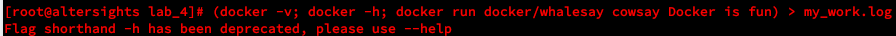

## Lab_4: Робота з Docker

### Pre-requirements:

- віртуальна машина (Ubuntu) з інстальованим Docker;

### What to do.

1. (:heavy_exclamation_mark:) Для ознайомляння що таке Docker зверніться до [документації](https://docs.docker.com/);

2. (:heavy_exclamation_mark:) Для перевірки чи докер встановлений і працює правильно на віртуальній машині запустіть перевірку версії, виведення допомоги та тестовий імедж:

    ```bash

    docker -v

    docker -h

    docker run docker/whalesay cowsay Docker is fun

    ```

    - (:heavy_exclamation_mark:) перенаправте вивід цих команд у файл `my_work.log` та закомітьте його до репозиторію.

    -  Виконав команду для сбереження виводу у файл my_work.log: `root# (docker -v; docker -h; docker run docker/whalesay cowsay Docker is fun) > my_work.log`
    -    

3. (:heavy_exclamation_mark:)  Як можна бачити Docker працює з Імеджами та Контейнерами. Імедж це свого роду операційна система з попередньо інстальованим ПЗ. Контейнер це запущений Імедж. Ідея роботи Docker дещо схожа на віртуальні машини. Перш за все потрібно створити імедж з якого буде запускатись контейнер. Для цього існує Dockerfile який описує контент імеджу. Ознайомтесь з [документацією](https://docs.docker.com/engine/reference/builder/).

4. (:heavy_exclamation_mark:) Для знайомства з Docker створимо імедж із Django сайтом зробленим у попередній роботі.

    - (:heavy_exclamation_mark:) Оскільки наш проект на Python то і базовий імедж також потрібно вибрати відповідний. Всі імеджі можна знайти на [Python Docker Hub](https://hub.docker.com/_/python). Використаємо команду щоб завантажити базовий імедж з репозиторію: (_це можна і не робити, оскільки при запуску Dockerfile може самостійно його завантажити_)

        ```bash

        docker pull python:3.7-slim

        docker images

        docker inspect python:3.7-slim

        ```

    - (:heavy_exclamation_mark:) Створіть файл з іменем `Dockerfile` скопіюйте туди вміс такого ж файлу з цього репозиторію;

    - (:heavy_exclamation_mark:) знайомтесь із коментарями та постарайтесь зрозуміти структуру написання Dockerfile;

    - (:heavy_exclamation_mark:) Замініть посилання на власний Git репозиторій із Вашим веб-сайтом та закомітьте даний Dockerfile*

5. (:heavy_exclamation_mark:) Створіть власний репозиторій на Docker Hub. Для цього залогіньтесь у власний аккаунт на [Docker Hub](https://hub.docker.com) після чого перейдіть у вкладку Repositories і далі натисніть кнопку `Create new repository`. Для прикладу мій репозиторій [знаходиться за адресою](https://cloud.docker.com/repository/registry-1.docker.io/bobas/lab4-examples).

6. (:heavy_exclamation_mark:) Виконайте білд (build) Docker імеджа та завантажте його до репозиторію. Для цього Ви повинні вказати правильну назву репозиторію та TAG. Оскільки мій репозиторій `bobas/lab4-examples` то команда буде виглядати (де `django` - це тег): 

    ```bash

    docker build -t nukedope/devops:djangus .

    docker images

    dokcer push nukedope/devops:djangus

    ```

    - при здачі роботи у файлі README вкажіть посилання на Ваш Docker Hub репозиторій та посилання на сказування Вашого імеджа;
      - [Посилання на hub](https://cloud.docker.com/repository/docker/nukedope/devops/general)
      - Видалення of image: `docker image rm nukedope/devops:djangus`
7. Для запуску веб-сайту потрібно виконати команду (тут я додав додаткові ключі, для чого Вони можете подивиьись у help):

    ```bash

    docker run -it --name=djangus --rm -p 8000:8000 nukedope/devops:djangus

    ``` 

    - перейдіть на аджесу `http://127.0.0.1:8000` та переконайтесь що Ваш веб-сайт працює;
    - 
8. Оскільки веб-сайт готовий і працює, потрібно створит ще один контейнер із програмою моніторингу нашого веб-сайту (Ваше Завдання на роботу):

    - (:heavy_exclamation_mark:) створіть ще один Dockerfile в якому помістіть програму моніторингу;

    - (:heavy_exclamation_mark:) виконайте білд даного імеджа та дайте йому тег `monitoring`;

    - (:heavy_exclamation_mark:) запустіть два контейнери одночасно (у різних вкладках) та переконайтесь що програма моніторингу успішно доступається до сторінок веб-сайту (_у випадку проблем з мережею використайте ключ `--net=host`_);
    - ВИКОРИСТАВ КЛЮЧ `--net=host` замість `-p 8000:8000`

    - (:heavy_exclamation_mark:) закомітьте Dockerfile та результати роботи програми моніторингу запущеної з Docker контейнера; (Результати в файлі my_work.log)

9. (:heavy_exclamation_mark:) Після успішного виконання роботи відредагуйте Ваш персональний _README.md_ у цьому репозиторію та створіть pull request.
